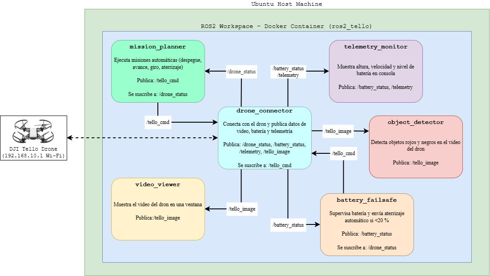

# Proyecto: Control de Dron DJI Tello con ROS2 y Docker

Este proyecto implementa un sistema completo para controlar, monitorear y procesar video del dron DJI Tello utilizando ROS 2 Jazzy, contenedores Docker y Python. Incluye seis nodos ROS2 para telemetría, control, misión automática, seguridad por batería, visualización y detección de objetos.

## Características Principales

- Control del dron mediante djitellopy.  
- Procesamiento de video en tiempo real (OpenCV + cv_bridge).  
- Arquitectura ROS2 modular basada en publishers/subscribers.  
- Ejecución aislada dentro de un contenedor Docker.  
- Detección de objetos mediante segmentación en HSV.  
- Nodo de seguridad automática por batería baja.

## Estructura del Proyecto

```
ros2_tello/
│── ros2_ws/
│   ├── src/
│   │   └── tello_control/
│   │       ├── tello_control/
│   │       │   ├── drone_connector.py
│   │       │   ├── mission_planner.py
│   │       │   ├── telemetry_monitor.py
│   │       │   ├── battery_failsafe.py
│   │       │   ├── video_viewer.py
│   │       │   └── object_detector.py
│   │       └── setup.py
│   └── Dockerfile
└── docker-compose.yml
```

## Instalación mediante Docker

### 1. Construir la imagen

```
sudo docker build -t ros2_tello_image .
```

### 2. Levantar el contenedor

```
sudo docker compose up -d
```

### 3. Entrar al contenedor

```
sudo docker exec -it ros2_tello bash
```

## Ejecución de Nodos ROS2

Antes de ejecutar cualquier nodo:

```
source /root/ros2_ws/install/setup.bash
```

### Nodos disponibles

| Nodo | Comando |
|------|---------|
| Conexión + video + telemetría | ros2 run tello_control drone_connector |
| Plan de misión automática | ros2 run tello_control mission_planner |
| Monitor de telemetría | ros2 run tello_control telemetry_monitor |
| Seguridad por batería | ros2 run tello_control battery_failsafe |
| Visualización del video | ros2 run tello_control video_viewer |
| Detección de objetos | ros2 run tello_control object_detector |

## Esquema General del Sistema

A continuación debe colocarse la imagen del esquema general del sistema:

  
(Insertar aquí el diagrama que muestra Docker → ROS2 → Dron DJI Tello)

## Descripción de Nodos

### drone_connector.py  
- Conecta con el dron.  
- Publica batería, altura y video.  
- Recibe comandos desde ROS2.

### mission_planner.py  
Plan simple:  
takeoff → forward → giro → forward → land

### telemetry_monitor.py  
Muestra datos en consola.

### battery_failsafe.py  
Aterriza si batería < 20%.

### video_viewer.py  
Muestra video con OpenCV.

### object_detector.py  
Detecta objetos rojos y negros con HSV.

## Resultados Principales

- Latencia del video: 0.18–0.25 s.  
- Comunicación estable (más del 98 por ciento de confirmaciones).  
- Misiones ejecutadas con precisión.  
- Detección de objetos estable entre 30 y 80 cm.

## Pruebas Realizadas

- Envío de comandos básicos.  
- Lectura continua de telemetría.  
- Visualización del video en ROS2 y OpenCV.  
- Activación del modo failsafe.  
- Prueba del plan de misión automática.  
- Detección de objetos rojos/negros.

## Repositorio

https://github.com/santiagm/Proyecto1_Drone_Tello_ROS

## Autores

- Mateo Eduardo Bermeo  
- Santiago Andrés Guillén  
- Vicente Paul Jiménez

Facultad de Ingeniería – Telecomunicaciones  
Universidad de Cuenca
